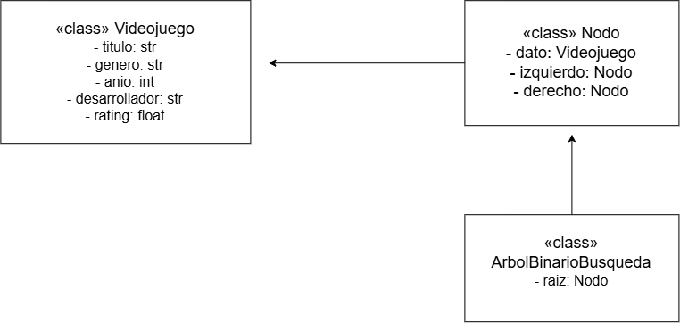

# 📄 Proyecto XVerse - Diagrama de Clases

## 📌 Introducción
El sistema XVerse utiliza clases en Python para representar videojuegos y estructuras de datos.  
Este documento describe las clases principales y sus relaciones.

---

## 🎮 Clases principales

### Clase `Videojuego`
- **Atributos:**
  - `titulo` (str)
  - `genero` (str)
  - `anio` (int)
  - `desarrollador` (str)
  - `rating` (float)
- **Responsabilidad:** Representa un videojuego con sus datos básicos.

---

### Clase `Nodo`
- **Atributos:**
  - `dato` (Videojuego)
  - `izquierdo` (Nodo)
  - `derecho` (Nodo)
- **Responsabilidad:** Nodo de un árbol binario que almacena un videojuego.

---

### Clase `ArbolBinarioBusqueda`
- **Atributos:**
  - `raiz` (Nodo)
- **Métodos:**
  - `insertar(videojuego)`
  - `buscar(titulo)`
  - `recorrer_inorder()`
  - `recorrer_preorder()`
  - `recorrer_postorder()`
- **Responsabilidad:** Gestiona la estructura de árbol binario para búsquedas eficientes.

---

## 🔗 Relaciones
- `Videojuego` es contenido dentro de un `Nodo`.
- `Nodo` se conecta con otros nodos (`izquierdo`, `derecho`) formando el árbol.
- `ArbolBinarioBusqueda` administra los nodos y provee operaciones de búsqueda y recorrido.

---

# 📊 Diagrama de Clases

El proyecto utiliza un **árbol binario de búsqueda** para organizar objetos de tipo `Videojuego`.  
El siguiente diagrama UML muestra las clases principales y sus relaciones:

- **Videojuego**: representa un videojuego con atributos básicos (`titulo`, `genero`, `anio`, `desarrollador`, `rating`).  
- **Nodo**: estructura que contiene un objeto `Videojuego` y referencias a otros nodos (`izquierdo`, `derecho`).  
- **ArbolBinarioBusqueda**: clase que gestiona la raíz del árbol y permite organizar los nodos.

## 📷 Representación UML

---

## 📎 Conclusión
El diagrama de clases refleja cómo se organiza la información en el sistema:  
- Los videojuegos se encapsulan en objetos (`Videojuego`).  
- Los nodos (`Nodo`) permiten estructurar los datos.  
- El árbol (`ArbolBinarioBusqueda`) ofrece búsquedas más rápidas que la lista secuencial.  

Este diseño se implementa en el **TP03** y es la base para futuras extensiones en los TP siguientes.
