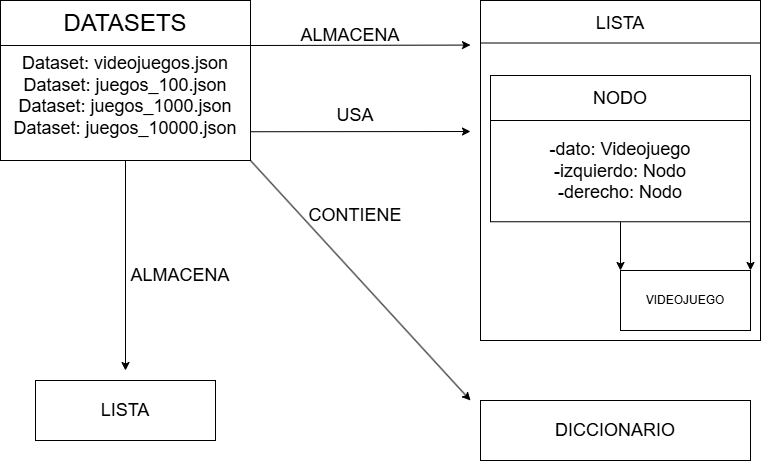

# 📄 Proyecto XVerse - Diagrama de Datos

## 📌 Introducción
El sistema XVerse utiliza distintos datasets de videojuegos y estructuras de datos para organizar y buscar información.  
Este documento describe cómo se relacionan los archivos JSON con las estructuras implementadas en los TP.

---

## 📂 Datasets utilizados
- `videojuegos.json` → Dataset principal con catálogo de juegos.  
- `juegos_100.json` → Dataset pequeño para pruebas de rendimiento.  
- `juegos_1000.json` → Dataset mediano para pruebas de rendimiento.  
- `juegos_10000.json` → Dataset grande para pruebas de rendimiento.  

---

## 🔗 Conexión con estructuras de datos
1. **Lista secuencial (TP01)**  
   - Los juegos se cargan en una lista de Python.  
   - Se recorren secuencialmente para listar o buscar títulos.  

2. **Árbol binario de búsqueda (TP03)**  
   - Cada juego se encapsula en un objeto `Videojuego`.  
   - Se inserta en un `Nodo` dentro del `ArbolBinarioBusqueda`.  
   - Permite búsquedas más rápidas que la lista secuencial.  

3. **Diccionario (TP02 - experimentos)**  
   - Los juegos se indexan por título en un diccionario de Python.  
   - Permite acceso directo con complejidad cercana a **O(1)**.  

---

## 📊 Representación esquemática
videojuegos.json ──► Lista ──► Búsqueda secuencial
└──► Árbol binario ──► Búsqueda eficiente
└──► Diccionario ──► Acceso directo

---

## 📎 Conclusión
El diagrama de datos muestra cómo los distintos **datasets JSON** se conectan con las estructuras de datos implementadas en los TP.  
Cada estructura ofrece un nivel distinto de eficiencia:  
- Lista → simple pero lenta.  
- Árbol binario → más eficiente para búsquedas.  
- Diccionario → acceso inmediato.  

Este diseño permite comparar rendimiento y elegir la estructura más adecuada según el tamaño del dataset.
